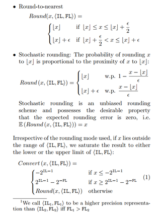
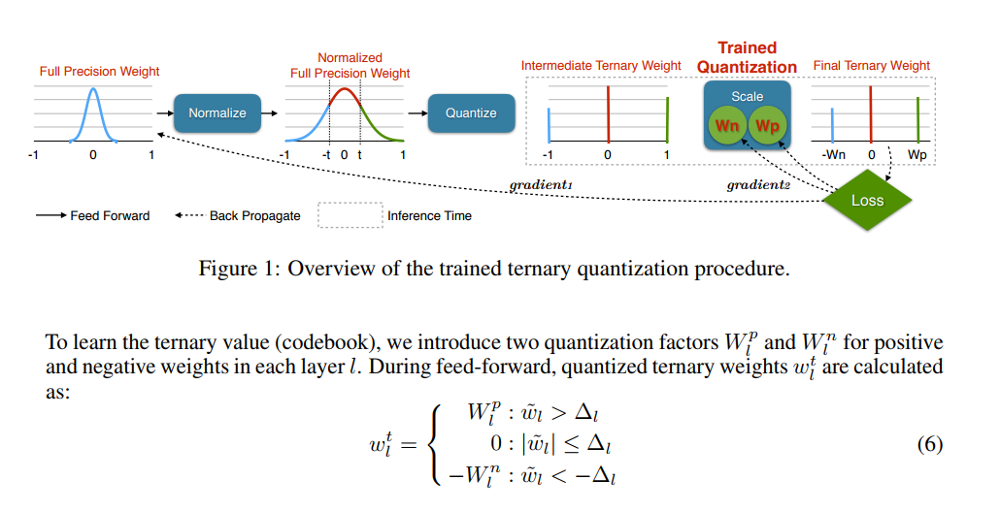
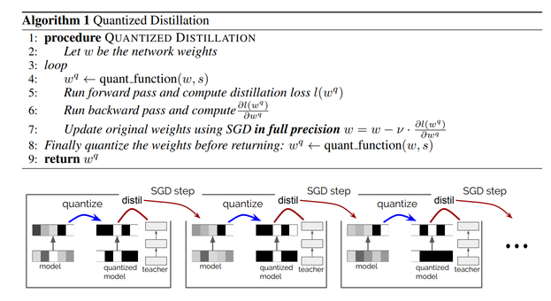
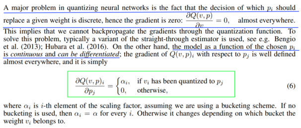

## Literature survey for Neural network Quantization 

| Title                                                                                   | Summary                                                                                                                                                                                                                                                                                                                                                                  | Link                             | Affiliations      |
|-----------------------------------------------------------------------------------------|--------------------------------------------------------------------------------------------------------------------------------------------------------------------------------------------------------------------------------------------------------------------------------------------------------------------------------------------------------------------------|----------------------------------|-------------------|
|Deep Learning with Limited Numerical precision   | [Summary](#Deep-Learning-with-Limited-Numerical-precision) | https://arxiv.org/abs/1502.02551 | Gupta et.al. IBM              |
|Trained Ternary Quantization   | [Summary](#Trained-Ternary-Quantization) | https://arxiv.org/abs/1612.01064 | Zhu et.al. Stanford              |
| Model Compression via Distillation and Quantization   | [Summary](#Deep-Learning-with-Limited-Numerical-precision) | https://arxiv.org/abs/1802.05668 | Polino et.al. DeepMind, ETH Zuirch              |
| Incremental Network Quantization: Towards Lossless CNNs with Low-Precision Weights (Zhou et. al.)   | [Summary](#Incremental-Network-Quantization-Towards-Lossless-CNNs-with-Low--Precision-Weights) | https://arxiv.org/abs/1702.03044 | Zhou et.al, Intel China          |

### Deep Learning with Limited Numerical precision
* Uses rounding modes 
  * Round-to-nearest.
  * Stochastic rounding.
  

### Trained Ternary Quantization
* Learn both the ternary weights and scale factors per layer. Both, positivie and negative scale factors are learned.

### Model Compression via Distillation and Quantization
* Two different methods. 
  1. *Quantized distillation*, aims to leverage distillation loss during the training process, by incorporating it into the training of a student network whose weights are constrained to a limited set of levels. 
  2. *Differentiable quantization*, attempts to converge to the optimal location of quantization points through stochastic gradient descent.

* Quantized Distillation

* Differentiable quantization

* Future works suggestes use of reinforcement learning. 
  * While the loss is continuous w.r.t. p, there are indirect effects when changing the way each weight
gets quantized. This can have drastic effect on the learning process. To avoid such issues, we rely on the following set of heuristics. Future work will look at adding a reinforcement learning loss for how the pi are assigned to weights.

### Incremental Network Quantization Towards Lossless CNNs with Low-Precision Weights
* The main goal of our INQ is to convert all 32-bit floating-point weights to be either powers of two or zero without loss of model accuracy.

* Convert Wl to be a low-precision version Wcl , and each of its entries is chosen from P<l> = {±2^n1 , · · · , ±2^n2, 0}, (1), where n1 and n2 are two integer numbers, and they satisfy n2 ≤ n1.
  * n1 = floor(log2(4s/3))
  * s = max(abs(Wl))
 
 * Weight partition is to divide the weights in each layer of a pre-trained full-precision CNN model into two disjoint groups. The weights in the first group are responsible for forming a low-precision base for the original model. The weights in the second group adapt to compensate for the loss in model accuracy, thus they are the ones to be re-trained. Once the first run of the quantization and re-training operations is finished, all the three operations are further conducted on the second weight group in an iterative manner, until all the weights are converted to be either powers of two or zero, acting as an incremental network quantization and accuracy enhancement procedure. 
