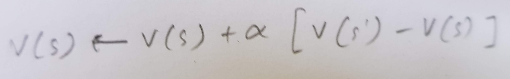

## Chapter 1 - Introduction

* __Value vs Reward__ The value of a state is the total amount of reward an agent can expect to accumulate over the future, starting from that state. Whereas rewards determine the immediate, intrinsic desirability of environmental states, values indicate the long-term desirability of states after taking into account the states that are likely to follow and the rewards available in those states.
* Comparision to other evolutionary learning methods
  * Solution methods such as _genetic algorithms, genetic programming, simulated annealing_, and other optimization methods never estimate value functions. These methods apply multiple static policies each interacting over an extended period of time with a separate instance of the environment.
  * If the space of policies is __sufficiently small__, or can be structured so that good policies are common or easy to find—or if a lot of time is available for the search—then evolutionary methods can be effective. 
  * In addition, evolutionary methods have __advantages__ on problems in which the _learning agent cannot sense the complete state_ of its environment.

* Approaching Tic-Tac-Toe problem 
** _Assumption_ If the board fills up with neither player getting three in a row, then the game is a draw. Because a skilled player can play so as never to lose, let us assume that we are playing against an imperfect player, one whose play is sometimes incorrect and allows us to win.
 * __Game theory__ “minimax” solution is not correct here because it assumes a particular way of playing by the opponent. For example, a minimax player would never reach a game state from which it could lose, even if in fact it always won from that state because of incorrect play by the opponent.
 * __Dynamic programming__ can compute an optimal solution for any opponent, but require as input a complete specification of that opponent, including the probabilities with which the opponent makes each move in each board state.
 * __Model based RL?__ About the best one can do on this problem is first to learn a model of the opponent’s behavior, up to some level of confidence, and then apply dynamic programming to compute an optimal solution given the approximate opponent model.
 * __Evolutionary Algorithms__ An evolutionary method applied to this problem would directly search the space of possible policies for one with a high probability of winning against the opponent. A typical evolutionary method would hill-climb
in policy space, successively generating and evaluating policies in an attempt to obtain incremental improvements. Or, perhaps, a genetic-style algorithm could be used that would maintain and evaluate a population of policies.
 * __(Model freee?)Reinforcement Learning__ Set up a value table. Each number will be the latest estimate of the probability of our winning from that state. We treat this estimate as the state’s value, and the whole table is the learned value function. We then play many games against the opponent. We choose our next state based on value function mostly greedly (exploitation) and sometimes exploring randomly. While we are playing, we change the values of the states in which we find ourselves during the game. We attempt to make them more accurate estimates of the probabilities of winning. To do this, we “back up” the value of the state after each greedy move to the state before the move. If we let St denote the state before the greedy move, and St+1 the state after the move, then the update to the estimated value of St, denoted V (St),can be written as

where alpha is a small positive fraction called the step-size parameter, which influences the rate of learning. This update rule is an example of a temporal-difference learning method. If thestep-size parameter is reduced properly over time, then this method converges, for any fixed opponent, to the true probabilities of winning from each state given optimal play by our player.
