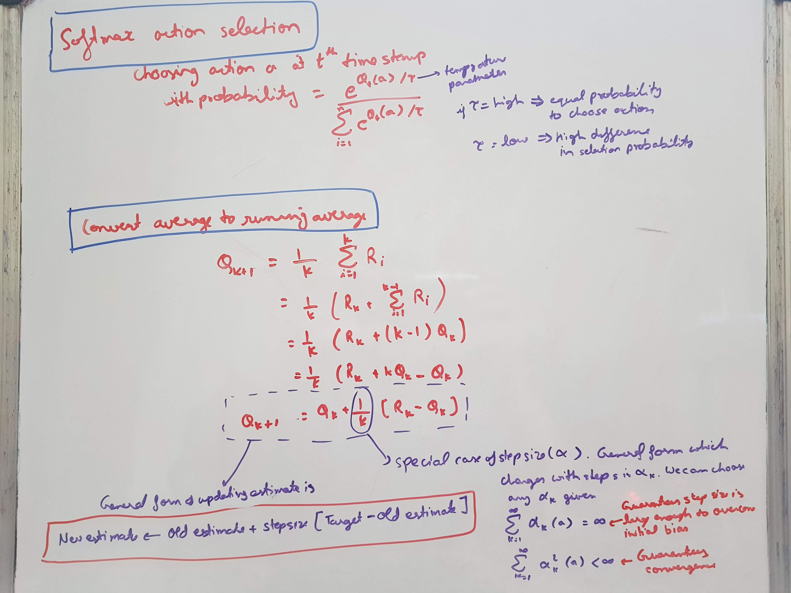
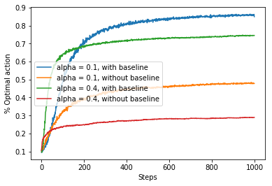
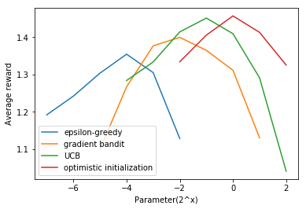

## Chapter 2: Bandit Prooblems 

* Greedy vs e-greedy
  * Greedy works good only for stationary, deterministic problems .
  * Large epsilon may hinder usage of learned information.
  * Small epsilon may learn slower. However generally will beat larger epsilon.
  
  
* Gradient bandit Algos
  
  
  
* Comaprision of Bandit Algos
  
