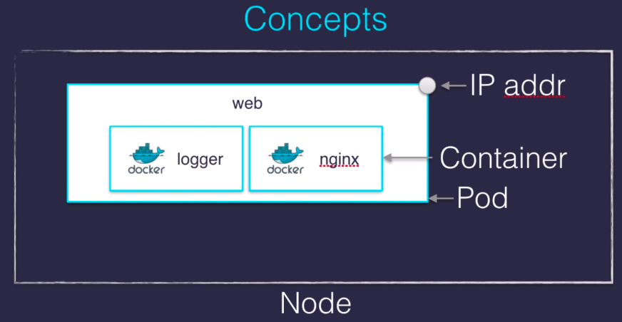

### Installation
```sh
sudo snap install microk8s --classic --channel=1.21/stable
sudo usermod -a -G microk8s $USER
sudo chown -f -R $USER ~/.kube
microk8s status --wait-ready
sudo microk8s status --wait-ready
```

### Concepts
 

### Kubectl
* Setup Kubectl
```sh
echo "alias kubectl='microk8s.kubectl'" >> ~/.bashrc
```
* Get commands
```sh
kubectl get nodes
kubectl get pods
kubectl get severices
kubectl get namespaces
kubectl get pods -A  # All namespaces
kubectl -n kube-system get pods # get pods from namespace kube-system
```
* Describe commnds
```sh
kubectl describe nodes <node name>
```
* Explore resources
```
kubectl describe nodes
kubectl explain [type] e.g. kubectl explain Pod
```
* run command
```sh
kubectl run NAME --image=image [--env="key=value"] [--port=port] [--replicas=replicas] [--dry-run=bool] [--overrides=inline-json] [--command] -- [COMMAND] [args...]
kubectl run pingpong --image alpine ping 1.1.1.1 # eg. run new container with image alping and use ping command 
```
* attach command # Attach to running docker
```sh
kubectl attach -it pingpong
```

* logs
```sh
kubectl logs pod/pingpong
```
